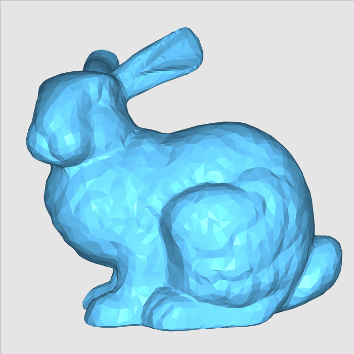
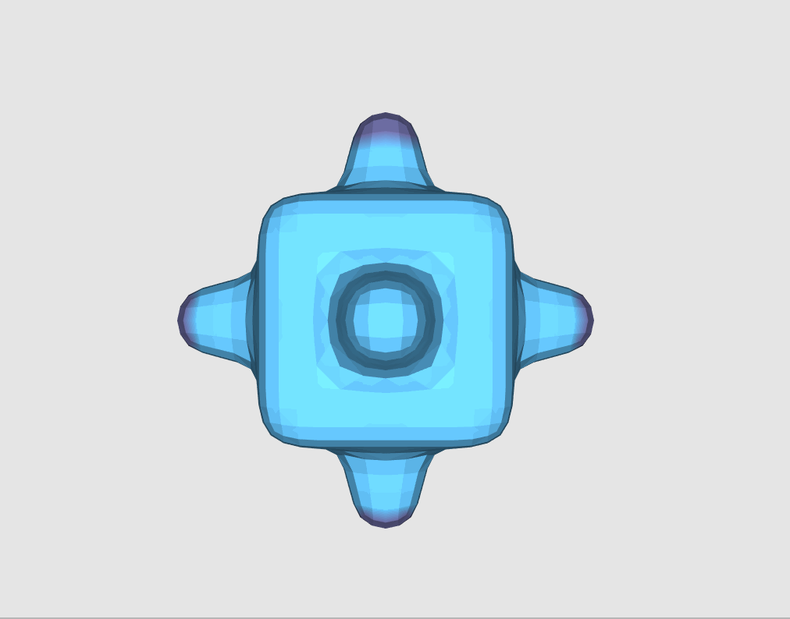

# Assignment 1

Implement four smoothing algorithms: Explicit/Implicit Laplacian smoothing using uniform/cotangent weights.

## Demo

|               |          Explicit           |          Implicit           |
| :-----------: | :-------------------------: | :-------------------------: |
|  **Uniform**  |    |    |
| **Cotangent** |  |  |

# Assignment 2

Implement a deformation algorithm: [Laplacian Surface Editing](http://igl.ethz.ch/projects/Laplacian-mesh-processing/Laplacian-mesh-editing/)

## Demo

# Note

There is a bug in the shading of the skeleton code. After applying smoothing, the new normals are computed but not uploaded to the shader. And there are some design flaws in the project. For example, the normals should be updated whenever the vertices are updated, instead of relying on a vertex-normals-dirty flag. Another example is that per-face normals need to be computed only when the shading scheme is flat, and per-vertex normals only when the shading scheme is smooth. I fixed the bug and did some refactoring.
